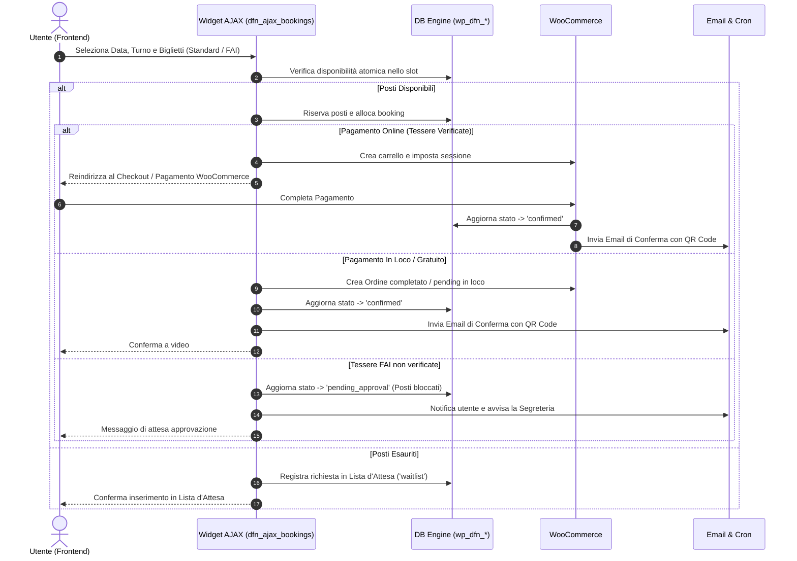

# 🎟️ Motore di Prenotazione & Flussi Operativi

Il motore di prenotazione DFN gestisce in modo unificato la disponibilità dei posti, il ticketing WooCommerce, la validazione delle tessere soci e le notifiche.

---

## 1. Ciclo di Vita della Prenotazione

---

## 2. Gestione Soci FAI
- L'utente può inserire 1 o più biglietti a prezzo ridotto per Soci FAI.
- Per ciascun biglietto FAI viene richiesto il numero di tessera e l'anagrafica intestatario.
- **Controllo duplicati**: La stessa tessera FAI non può essere inserita due volte nella stessa prenotazione, né essere riutilizzata per lo stesso evento.
- **Verifica automatica**: Se il numero tessera esiste nella tabella `wp_dfn_fai_members` ed è valido, lo sconto viene applicato istantaneamente.
- **Flusso manuale (*Pending Approval*)**: Se la tessera non è presente o non coincide il nominativo, l'ordine non fallisce: viene inviato in approvazione manuale alla segreteria, trattenendo i posti per evitare overbooking.

---

## 3. Gestione Lista d'Attesa (*Waitlist*)
- Se un turno raggiunge la capienza massima (incluso l'eventuale margine di overbooking consentito), il widget permette di iscriversi alla Lista d'Attesa.
- In caso di cancellazione di una prenotazione confermata, il sistema notifica automaticamente i candidati in lista d'attesa in ordine cronologico di registrazione.
