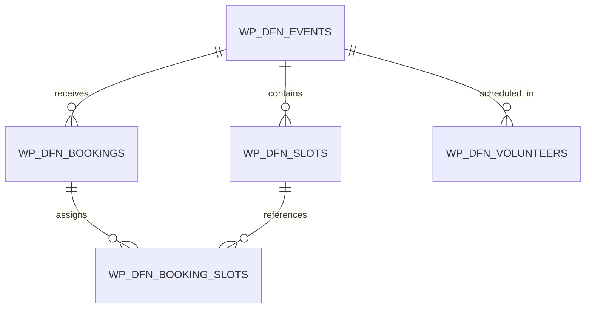

# 🗄️ Schema Database & Tabelle Personalizzate

Il sistema estende il database di WordPress con tabelle personalizzate create e gestite tramite `dbDelta` in [dfn-database.php](file:///c:/Users/Alex/Desktop/web-server/dfn-bedrock/web/app/themes/dfn-theme/inc/core/dfn-database.php).

---

## 1. Mappa delle Tabelle

---

## 2. Dettaglio Tabelle

### `wp_dfn_events`
Memorizza le configurazioni principali di ciascun evento.

| Colonna | Tipo | Descrizione |
|---|---|---|
| `id` | `BIGINT(20) UNSIGNED` | Chiave primaria auto-increment |
| `product_id` | `BIGINT(20) UNSIGNED` | ID del prodotto WooCommerce associato |
| `title` | `VARCHAR(255)` | Titolo dell'evento |
| `access_type` | `VARCHAR(20)` | `slots` (a fasce orarie) o `free_flow` (accesso libero) |
| `payment_mode` | `VARCHAR(20)` | `online` (Stripe/PayPal), `in_loco` (cassa), `gratuito` |
| `price_standard`| `DECIMAL(10,2)` | Prezzo biglietto intero |
| `price_fai` | `DECIMAL(10,2)` | Prezzo biglietto ridotto soci FAI |
| `is_active` | `TINYINT(1)` | Flag abilitazione prenotazioni (1=attivo, 0=bozza) |
| `created_at` | `DATETIME` | Timestamp di creazione |

---

### `wp_dfn_slots`
Memorizza i turni orari specifici per ciascuna giornata dell'evento.

| Colonna | Tipo | Descrizione |
|---|---|---|
| `id` | `BIGINT(20) UNSIGNED` | Chiave primaria auto-increment |
| `event_id` | `BIGINT(20) UNSIGNED` | Riferimento a `wp_dfn_events.id` |
| `slot_date` | `DATE` | Data del turno (YYYY-MM-DD) |
| `start_time` | `TIME` | Orario inizio turno (HH:MM:SS) |
| `end_time` | `TIME` | Orario fine turno (HH:MM:SS) |
| `max_capacity` | `INT(11)` | Capienza massima ordinaria |
| `overbooking_max` | `INT(11)` | Posti extra ammessi in overbooking |
| `booked_count` | `INT(11)` | Conteggio posti attualmente confermati |
| `status` | `VARCHAR(20)` | `active`, `closed`, `cancelled` |

---

### `wp_dfn_bookings`
Memorizza la prenotazione complessiva collegata all'ordine WooCommerce.

| Colonna | Tipo | Descrizione |
|---|---|---|
| `id` | `BIGINT(20) UNSIGNED` | Chiave primaria auto-increment |
| `order_id` | `BIGINT(20) UNSIGNED` | ID dell'ordine WooCommerce |
| `event_id` | `BIGINT(20) UNSIGNED` | Riferimento a `wp_dfn_events.id` |
| `user_id` | `BIGINT(20) UNSIGNED` | ID utente WP (opzionale se guest) |
| `status` | `VARCHAR(30)` | `confirmed`, `pending_payment`, `pending_approval`, `cancelled`, `waitlist` |
| `qr_code_hash` | `VARCHAR(64)` | Token univoco sha256 per QR code |
| `checkin_status`| `VARCHAR(20)` | `pending`, `checked_in`, `partial` |
| `checkin_at` | `DATETIME` | Timestamp convalida ingresso |

---

### `wp_dfn_booking_slots`
Tabella di giunzione N:M tra prenotazioni e turni per gestire prenotazioni multi-slot o scaglionate.

| Colonna | Tipo | Descrizione |
|---|---|---|
| `id` | `BIGINT(20) UNSIGNED` | Chiave primaria |
| `booking_id` | `BIGINT(20) UNSIGNED` | Riferimento a `wp_dfn_bookings.id` |
| `slot_id` | `BIGINT(20) UNSIGNED` | Riferimento a `wp_dfn_slots.id` |
| `quantity` | `INT(11)` | Numero di posti assegnati su questo turno |

---

### `wp_dfn_fai_members`
Registro anagrafico per la validazione automatica delle tessere FAI.

| Colonna | Tipo | Descrizione |
|---|---|---|
| `id` | `BIGINT(20) UNSIGNED` | Chiave primaria |
| `card_number` | `VARCHAR(50)` | Numero tessera FAI (indicizzato) |
| `first_name` | `VARCHAR(100)` | Nome socio |
| `last_name` | `VARCHAR(100)` | Cognome socio |
| `status` | `VARCHAR(20)` | `active`, `expired`, `suspended` |
| `expiry_date` | `DATE` | Data scadenza validità |
| `created_at` | `DATETIME` | Data inserimento |
